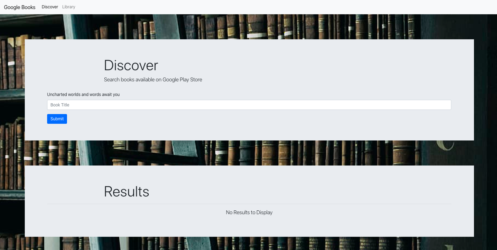
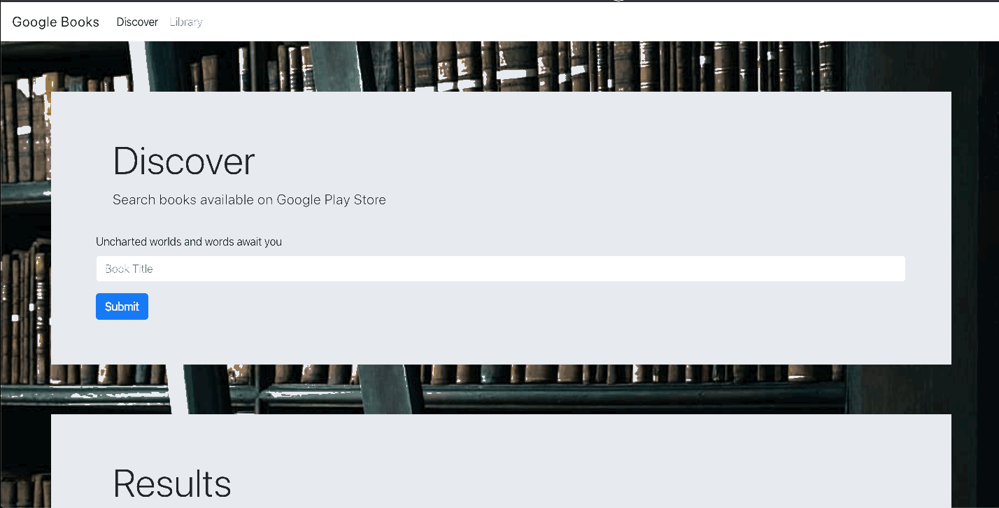
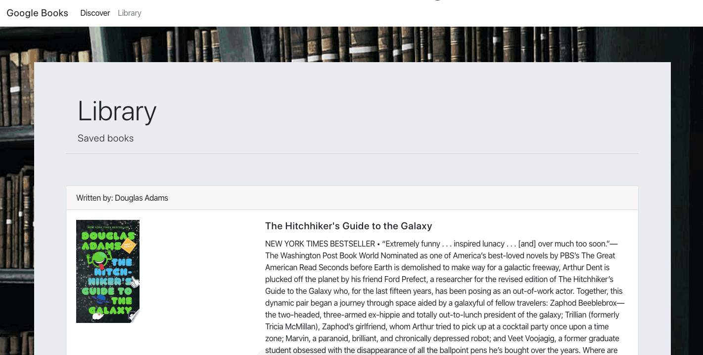
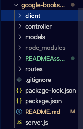
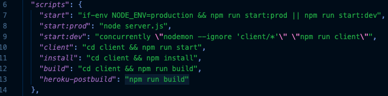
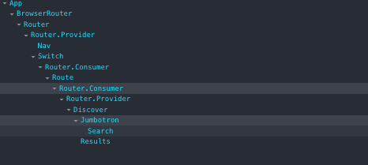
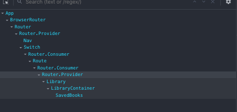

# { React } Google Books App

{ React } Google Books App enables users to search and save books available on Google Books Store. It is built with a MERN stack, featuring React components utilizing React lifecycle methods to query and display books based on user searches. These books can be viewed in Google Books and saved to the user's Library.

Check out the deployed application today on Heroku: [{ React } Google Books App](https://googlebookslibrary.herokuapp.com/discover)

## Table of Contents

- [Technologies](#Technologies)
- [Demo](#Demo)
- [Functionality](#Functionality)
- [Future Development](#Future-Development)

## Technologies

This application utilizes a myriad of technologies:

1. Node.js
2. MongoDB in conjunction with Mongoose
3. React
4. Express
5. Bootstrap

## Demo

A demonstration of a user querying a book and saving it to their library:

A demonstration of a user's library and deletion of a book:

## Functionality

This application utilizes the full power of the MERN stack in order to function seamlessly for an enjoyable user experience.

The application code is structured as shown in the following image:

Our controller, models, and routes files all funnel through our server.js file and creates the back-end of our application. The back-end of our application enables user's to save and delete books to a MongoDB with the use of Mongoose, Express and Node.js. Through the `package.json` scripts upon `npm run start` the back-end is able to access the front-end of our application:

The client folder hosts all of our front-end code. The client package hosts a package with a proxy which enables it to handle and process the functionality of the back-end of our code.

This is a two page application, Discover and Library, through which many components are implemented.

The following is the Discover page components:

The following is the Library page components:

## Future Development

For future development, I would enable users to create an account in order to enable multi-user usability as well as privacy.

I would also incorporate React hooks in order to make the code cleaner and avoid prop drilling.
